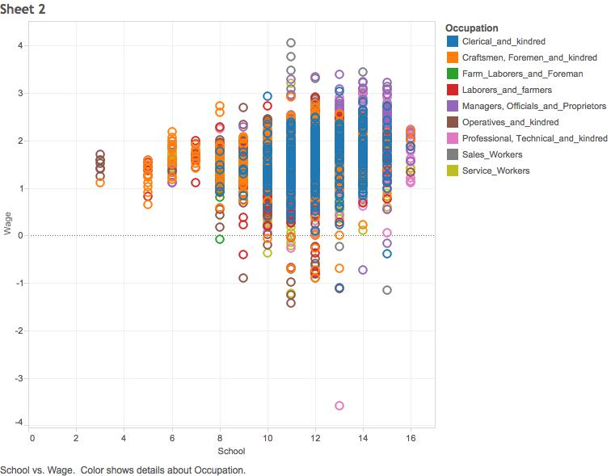
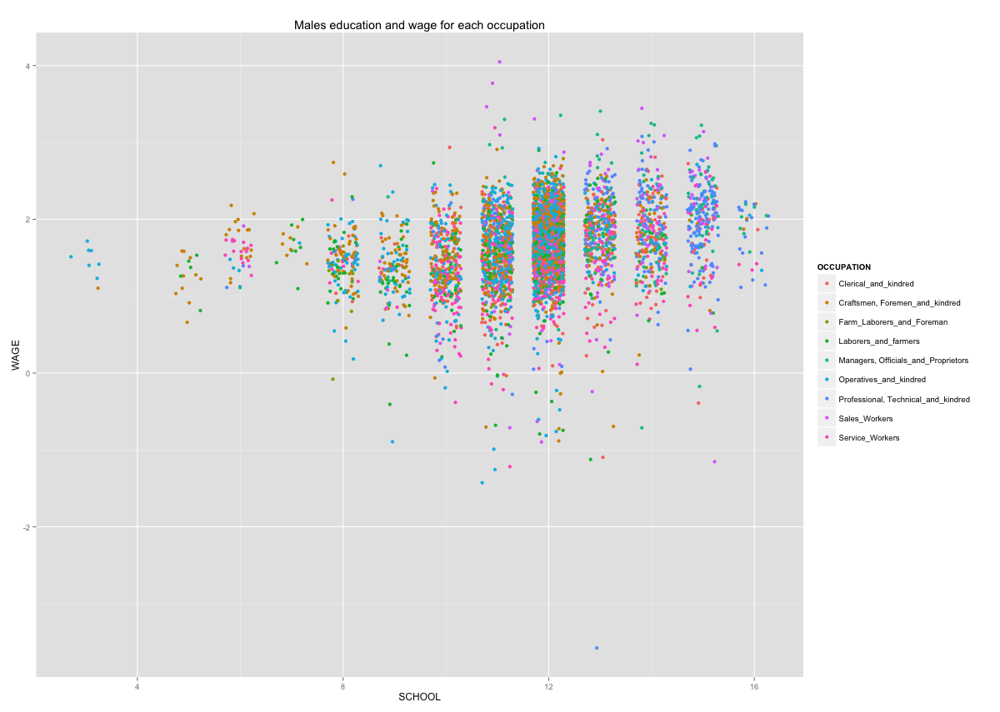
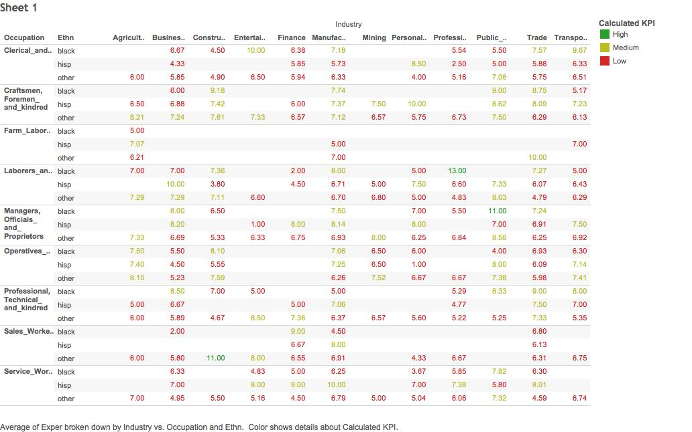
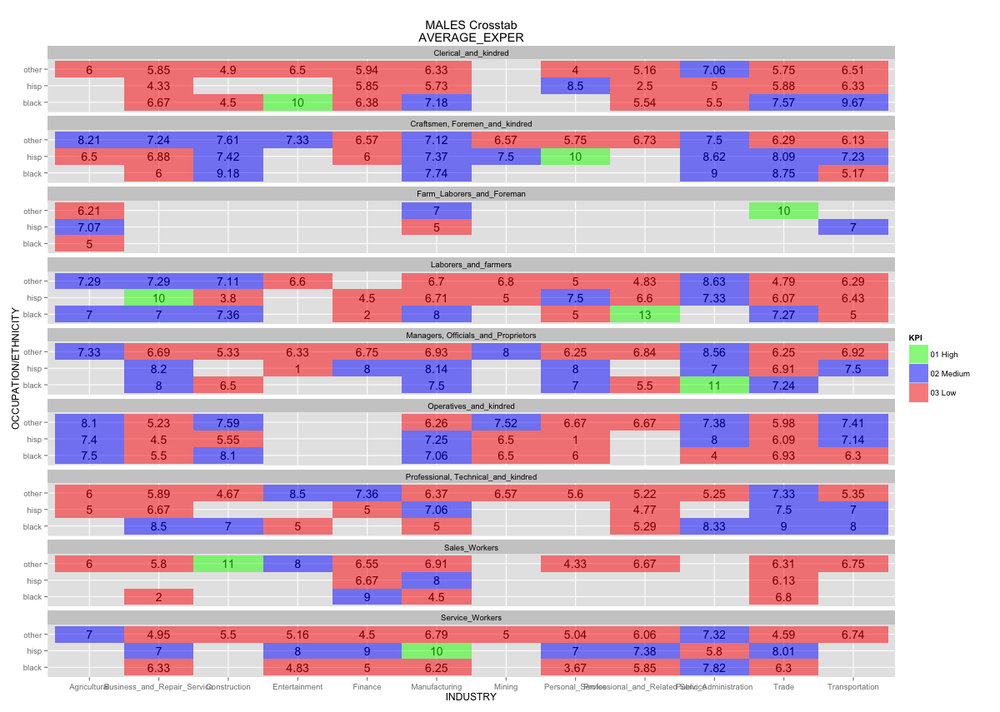
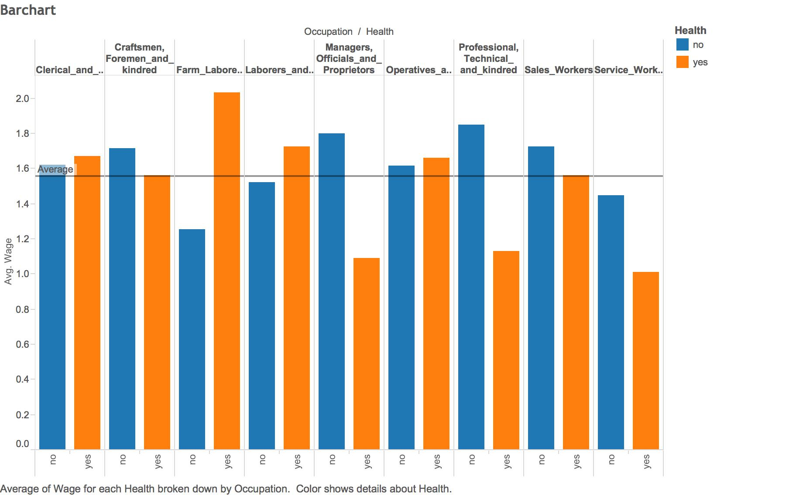
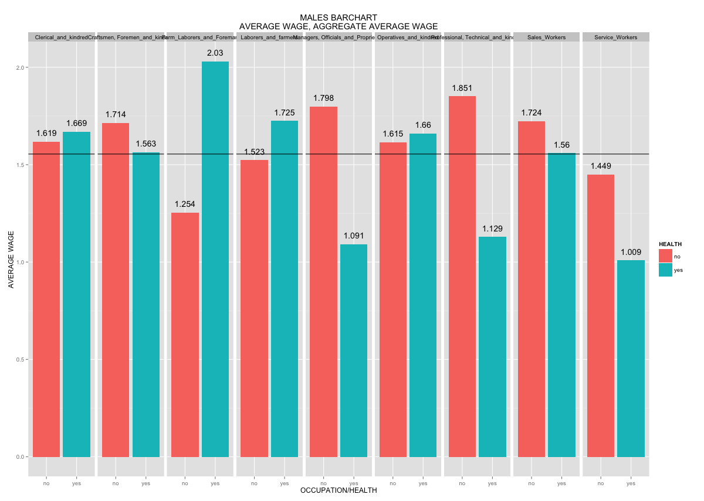
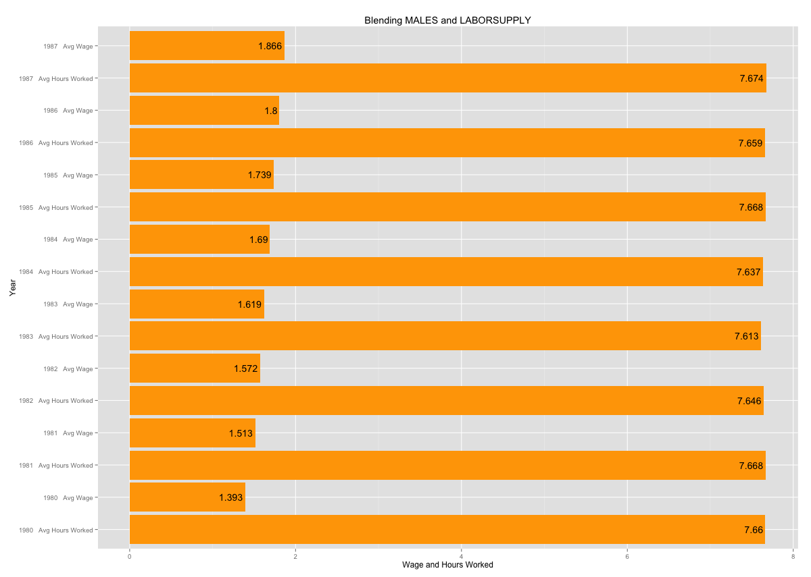
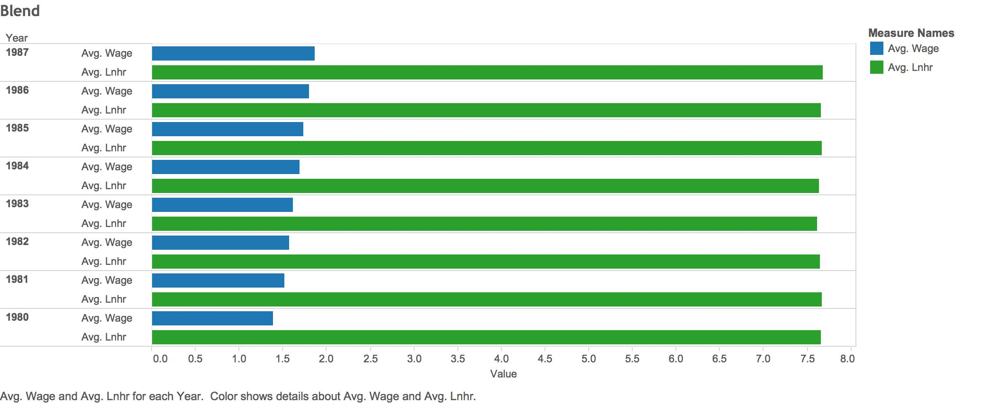

## Step 1: Load CSV File for labor supply into Tableau and Oracle

*Our labor supply data shows in a period of 1979 to 1988, the log of the hours worked, log of wages earned, number of kids, age, and whether the person is disabled

***Process*** <br/>
1. Insert csv file as a data source into Tableau <br/>
2. Load the csv file into Oracle account using a modified version of R_ETL.R. 

```{r, eval=FALSE}
require(tidyr)
require(dplyr)
require(ggplot2)

setwd("~/DataVisualization/DV_RProject5/01 Data")

file_path <- "Laborsupply.csv"

df <- read.csv(file_path, stringsAsFactors = FALSE)

# Replace "." (i.e., period) with "_" in the column names.
names(df) <- gsub("\\.+", "_", names(df))

# str(df) # Uncomment this and  run just the lines to here to get column types to use for getting the list of measures.

measures <- c("Age", "Disab", "F1", "Kids", "Lnhr", "Lnwg")
#measures <- NA # Do this if there are no measures.

# Get rid of special characters in each column.
# Google ASCII Table to understand the following:
for(n in names(df)) {
  df[n] <- data.frame(lapply(df[n], gsub, pattern="[^ -~]",replacement= ""))
}

dimensions <- setdiff(names(df), measures)
if( length(measures) > 1 || ! is.na(dimensions)) {
  for(d in dimensions) {
    # Get rid of " and ' in dimensions.
    df[d] <- data.frame(lapply(df[d], gsub, pattern="[\"']",replacement= ""))
    # Change & to and in dimensions.
    df[d] <- data.frame(lapply(df[d], gsub, pattern="&",replacement= " and "))
    # Change : to ; in dimensions.
    df[d] <- data.frame(lapply(df[d], gsub, pattern=":",replacement= ";"))
  }
}

library(lubridate)
# Fix date columns, this needs to be done by hand because | needs to be correct.
#                                                        \_/
df$Order_Date <- gsub(" [0-9]+:.*", "", gsub(" UTC", "", mdy(as.character(df$Order_Date), tz="UTC")))
df$Ship_Date  <- gsub(" [0-9]+:.*", "", gsub(" UTC", "", mdy(as.character(df$Ship_Date),  tz="UTC")))

# The following is an example of dealing with special cases like making state abbreviations be all upper case.
# df["State"] <- data.frame(lapply(df["State"], toupper))

# Get rid of all characters in measures except for numbers, the - sign, and period.dimensions
if( length(measures) > 1 || ! is.na(measures)) {
  for(m in measures) {
    df[m] <- data.frame(lapply(df[m], gsub, pattern="[^--.0-9]",replacement= ""))
  }
}

write.csv(df, paste(gsub(".csv", "", file_path), ".reformatted.csv", sep=""), row.names=FALSE, na = "")

tableName <- gsub(" +", "_", gsub("[^A-z, 0-9, ]", "", gsub(".csv", "", file_path)))
sql <- paste("CREATE TABLE", tableName, "(\n-- Change table_name to the table name you want.\n")
if( length(measures) > 1 || ! is.na(dimensions)) {
  for(d in dimensions) {
    sql <- paste(sql, paste(d, "varchar2(4000),\n"))
  }
}
if( length(measures) > 1 || ! is.na(measures)) {
  for(m in measures) {
    if(m != tail(measures, n=1)) sql <- paste(sql, paste(m, "number(38,4),\n"))
    else sql <- paste(sql, paste(m, "number(38,4)\n"))
  }
}
sql <- paste(sql, ");")
cat(sql)
```

## Step 2: Create a scatterplot in RStudio to replicate scatterplot created in Tableau
*The visualization below shows that to get decent wages, people need to have between 11 to 14 years of schooling. 

***Process*** <br/>
1. Create SQL code in R to select all data from "Males" table <br/>
2. Give the scatterplot a title, "Males education and wage for each occupation" <br/>
3. Put down the x axis as "school" and the y axis as "wage" <br/>

Image below shows scatterplot created in Tableau.


Image below shows scatterplot created in R studio. </br>


## Step 3: Create a crosstab in RStudio to replicate crosstab created in Tableau
*What stood out in the data is the blacks were most experienced as laborers and farmers, as well as managers, officials and proprietors in the professional and related service industry and public administration industry compared to Hispanics, and other racial ethnicities including White people, Asians, and Native Americans. 

***Process*** <br/>
1. Identify KPI_Low_Max_value as 7 and KPI_Medium_Max_value as 10 <br/>
2. Create SQL statement in R to find KPI, average work experience of young males and group data by ethnicity, occupation and industry <br/>
3. Title the crosstab "Males Crosstab AVERAGE_EXPER" <br/>
4. Label and set the x axis as "Industry" and the y axis as "Occupation/Ethnicity" <br/>
5. Add in a layer for color that is based on the KPI <br/>

Image below shows crosstab created in Tableau.


Image below shows crosstab created in R studio. </br>


## Step 4: Create a barchart in RStudio to replicate barchart created in Tableau

*The visualization below shows that higher pay in more physical jobs have a correlation with health problems.

***Process*** <br/>
1. Create SQL statement to get average wage and aggregate average wage in R <br/>
2. Create new column called "TOTAL_AVG" which is the mean of the aggregate average wage </br>
3. Title the bargraph, "Males Barchart Average wage, aggregate average wage" </br>
4. Label the x axis as "Occupation/Health" and the y axis as "Average Wage" </br>
5. Set the x axis as health and the y axis as average wage and the color of the bars as health </br>
6. Label each bar with the average wage </br>
7. Add the reference line into the diagram </br>

Image below shows crosstab created in Tableau.


Image below shows crosstab created in R studio. </br>


## Step 5a: Do datablend of two datasets, Males.csv and Laborsupply.csv and create visualizations in R studio

*Although from 1980 to 1987, number of hours worked stay the same on average, however the wages of young males increased. 

***Process***
1. Create SQL statement in R to blend the data files to create output file that shows only measure names and measure values </br>
2. Take out 1979 and 1988 from the data because those two years are not common to both datasets </br>
3. Set up the barchart and title as "Blending Males and Labour supply" </br>
4. Set and label x axis as "year" (with avg wage and avg hours worked as two seperate variables) and y axis as "wage and hours worked" </br>
5. Set the color to orange </br>
6. Flip the x and y axis </br>
7. Label the bars with the values </br>

Image below shows crosstab created in R studio. </br>


## Step 5b: Do datablend of two datasets, Males.csv and Laborsupply.csv and create visualizations in Tableau
*Although from 1980 to 1987, number of hours worked stay the same on average, however the wages of young males increased. 

***Process***
1. Extract laborsupply.csv as a datasource </br>
2. Go to "data", "edit relationships", "custom", and add year </br>
2. Drag "year" and "measure names" to rows </br>
3. Drag "measure values" to columns </br>

Image below shows crosstab created in Tableau. </br>


## Head and summary for Males.csv

```{r, echo=FALSE}
require("jsonlite")
require("RCurl")

df <- data.frame(fromJSON(getURL(URLencode('skipper.cs.utexas.edu:5001/rest/native/?query="select * from MALES"'),httpheader=c(DB='jdbc:oracle:thin:@sayonara.microlab.cs.utexas.edu:1521:orcl', USER='C##cs329e_jso464', PASS='orcl_jso464', MODE='native_mode', MODEL='model', returnDimensions = 'False', returnFor = 'JSON'), verbose = TRUE)))

summary(df)
head(df)
```

## Head and summary for Laborsupply.csv

```{r, echo=FALSE}
require("jsonlite")
require("RCurl")

df <- data.frame(fromJSON(getURL(URLencode('skipper.cs.utexas.edu:5001/rest/native/?query="select * from LABORSUPPLY"'),httpheader=c(DB='jdbc:oracle:thin:@sayonara.microlab.cs.utexas.edu:1521:orcl', USER='C##cs329e_jso464', PASS='orcl_jso464', MODE='native_mode', MODEL='model', returnDimensions = 'False', returnFor = 'JSON'), verbose = TRUE)))

summary(df)
head(df)
```
